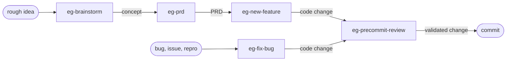

# Elephant/Goldfish (Claude Code, Codex, Gemini CLI)


A reusable workflow for software work with Claude Code, Codex, and Gemini CLI, built around the elephant/goldfish pattern from [Daniel Rensin's article](https://drensin.medium.com/elephants-goldfish-and-the-new-golden-age-of-software-engineering-c33641a48874).

---

## How to install

### Claude Code


In your target repo, open a Claude Code session and paste this message:

> Fetch the elephant-goldfish bootstrap procedure with
> `gh api repos/vshvedov/elephant-goldfish/contents/claude/BOOTSTRAP.md -H 'Accept: application/vnd.github.raw'`,
> then follow the procedure to set up the elephant/goldfish workflow here, preserving any existing setups for other AIs.

When done, reload Claude Code session (restart the app) and try:

```
/eg-brainstorm I'm starting a new app...

```

The root `BOOTSTRAP.md` remains as a compatibility entrypoint for older install snippets, but new Claude installs should fetch `claude/BOOTSTRAP.md` directly.

### Codex (beta)


In the same target repo, open a Codex session and paste this message:

> Fetch the Codex elephant-goldfish bootstrap procedure with
> `gh api repos/vshvedov/elephant-goldfish/contents/codex/BOOTSTRAP.md -H 'Accept: application/vnd.github.raw'`,
> then follow the procedure to set up the Codex elephant/goldfish workflow here, preserving any existing setups for other AIs.

When done, you'll have a set of "Elephant/Goldfish" Codex skills. Try this:

```
$eg...
```

### Gemini CLI (beta)


In your target repo, open a Gemini CLI session and paste this message:

> Fetch the Gemini CLI elephant-goldfish bootstrap procedure with
> `gh api repos/vshvedov/elephant-goldfish/contents/gemini/BOOTSTRAP.md -H 'Accept: application/vnd.github.raw'`,
> then follow the procedure to set up the Gemini CLI elephant/goldfish workflow here, preserving any existing setups for other AIs.

---

*The installs are additive. Claude Code gets `.claude/commands/` and `CLAUDE.md`; Codex gets a repo-local plugin with skills, user-skill symlinks for autocomplete, and `AGENTS.md`; Gemini CLI gets local workspace Skills in `.gemini/skills/` plus `GEMINI.md`. They can live in the same repo and should mirror the same project conventions.*

---

## What you get

Five workflow commands/skills for each agent:

| Stage | Claude Code | Codex | Gemini CLI |
|---|---|---|---|
| Brainstorm | `/eg-brainstorm` | `Use $eg-brainstorm ...` | `eg-brainstorm` Skill |
| PRD | `/eg-prd` | `Use $eg-prd ...` | `eg-prd` Skill |
| Bug fix | `/eg-fix-bug` | `Use $eg-fix-bug ...` | `eg-fix-bug` Skill |
| New feature | `/eg-new-feature` | `Use $eg-new-feature ...` | `eg-new-feature` Skill |
| Precommit review | `/eg-precommit-review` | `Use $eg-precommit-review ...` | `eg-precommit-review` Skill |

Claude Code uses the templates in [claude/](claude/), installs into `<target>/.claude/commands/`, and injects a "Working with Claude Code" section into `CLAUDE.md`.

Codex uses the templates in [codex/](codex/), installs a project-local plugin with skills under `<target>/plugins/elephant-goldfish-codex/`, registers it in `<target>/.agents/plugins/marketplace.json`, activates it in `~/.codex/config.toml`, symlinks the skills into `${CODEX_HOME:-~/.codex}/skills/eg-*` for composer autocomplete in current Codex app builds, and injects a "Working with Codex (elephant/goldfish)" section into `AGENTS.md`.

Gemini CLI uses the templates in [gemini/](gemini/), installs workspace-scoped skills under `<target>/.gemini/skills/`, and injects a "Working with Gemini CLI" section into `GEMINI.md`.

All bootstraps inspect the target stack and customize the generic templates for the detected language, test tiers, browser/simulator validation path, project-specific review gotchas, and commit convention. See [Bootstrap a new repo](#bootstrap-a-new-repo) below for the full procedure.

**Why `gh api` instead of `git clone`?** No working copy left lying around — just text streamed in, customized, and written into the target. Cleaner than clone for a one-shot setup, and works the same whether this repo is public or private.

---

## The pattern

### Elephant

Your working session: Claude Code, Codex, or Gemini CLI with full context — this conversation, the repo instructions (`CLAUDE.md`, `AGENTS.md`, or `GEMINI.md`), files read in recent turns, and decisions already made together. The elephant carries the institutional memory.

### Goldfish

A fresh subagent spawned with no prior context. It receives only what you hand it: a problem statement, a design doc, or a diff. It has no idea what you've been thinking. That's the point.

### The asymmetry is the test

If a goldfish, given only the problem statement, lands somewhere different from where the elephant started, that disagreement is the cheapest signal you'll get that you were anchored. If a goldfish, given only the design doc, can't implement the same thing you intended, the doc is wrong — not the goldfish. **Design is the new code.** When AI generates more code than humans can review, the human-readable doc becomes the primary artifact, and a fresh reader who can act on it alone is the cheapest correctness check available.

---

## The pipeline

> `eg-brainstorm` produces a **concept**. `eg-prd` turns a concept into **requirements**. `eg-new-feature` and `eg-fix-bug` produce **code**. `eg-precommit-review` produces **validated code**. Each upstream stage feeds the next.



You don't have to start at the top. Pick the stage that matches what you have:

| You have | Start with | The output |
|---|---|---|
| A half-formed thought, no direction yet | `eg-brainstorm` | A concepts brief; pick a direction. |
| A direction but no requirements | `eg-prd` | A PRD: scope, users, metrics, open questions. |
| A clear feature to build | `eg-new-feature` | Implemented + reviewed code, ready to commit. |
| A bug or a `#<issue>` | `eg-fix-bug` | A failing-test-driven fix, ready to commit. |
| A diff already in hand | `eg-precommit-review` | A reviewer-cleared diff, ready to commit. |

### How each stage uses the pattern

**`eg-brainstorm`** inverts the pattern. Instead of one goldfish stress-testing the elephant, multiple goldfish run in parallel — each with a different lens (technical, business, UX, contrarian, market research) — to generate divergent ideas the elephant synthesizes into a concepts brief. Agents use structured clarifying questions (`AskUserQuestion`, `ask_user`, or structured prompts) to interact with the user.

**`eg-prd`** uses two waves of goldfish. First, exploration goldfish ground the request in the existing codebase. Then, after structured gap-filling Q&A with the user, research goldfish run in parallel across distinct lenses. The elephant synthesizes a PRD with explicit Open Questions for whatever the user deferred.

**`eg-new-feature`** uses one goldfish to stress-test the design doc the elephant drafted. If the goldfish can't implement the same thing from the doc alone, the doc gets revised. Implementation only starts after the doc is "design ready." Then the same diff goes through `eg-precommit-review`.

**`eg-fix-bug`** uses one goldfish to diagnose the bug from only the symptom and repro. The elephant's hypothesis stays hidden until after the goldfish reports — convergence buys confidence; divergence is signal. The bug gets captured as a failing test before any fix is written.

**`eg-precommit-review`** is itself a goldfish. It sees only the diff, not the conversation. Findings are triaged round by round, with a hard cap and a structured user escalation if the loop doesn't converge.

---

## Commands And Skills

| Intent | Claude Code | Codex | Gemini CLI |
|---|---|---|---|
| Early-stage concept design | `/eg-brainstorm <rough idea>` | `Use $eg-brainstorm to brainstorm <rough idea>` | Invoke `eg-brainstorm` skill |
| PRD from idea / feature / issue | `/eg-prd <idea \| feature \| #issue>` | `Use $eg-prd to write a PRD for <idea \| feature \| #issue>` | Invoke `eg-prd` skill |
| Bug fix flow | `/eg-fix-bug <description \| #issue \| URL>` | `Use $eg-fix-bug to fix <description \| #issue \| URL>` | Invoke `eg-fix-bug` skill |
| Feature flow | `/eg-new-feature <description \| #issue \| URL>` | `Use $eg-new-feature to build <description \| #issue \| URL>` | Invoke `eg-new-feature` skill |
| Independent diff review | `/eg-precommit-review` | `Use $eg-precommit-review to review my pending changes` | Invoke `eg-precommit-review` skill |

Implementation flows (`eg-fix-bug`, `eg-new-feature`) stop short of committing. The user authorizes the commit explicitly when ready.

Codex note: current Codex builds do not support project-defined custom slash commands, so `/eg-*` and `/elephant-goldfish-codex:eg-*` are not expected to appear in the slash-command menu. Use `$eg-*` skill mentions instead.

You give a one-liner; the agent writes the doc back at you. **You don't author docs by hand.** Most docs live in chat. They land on disk only when there's a future-you reason to keep them — a substantial feature, a new subsystem, a saved brainstorm brief, a PRD that will be revisited.

---

## Bootstrap a new repo

(See [How to install](#how-to-install) at the top for the one-line invocation.)

After you give Claude the `gh api` instruction, Claude will:

1. Read [claude/BOOTSTRAP.md](claude/BOOTSTRAP.md) for the procedure.
2. Inspect the target repo's stack — `package.json`, `Gemfile`, `pubspec.yaml`, `pyproject.toml`, `mise.toml`, `.tool-versions`, CI config, etc.
3. Read the target's `CLAUDE.md` if it exists; otherwise propose creating one.
4. Customize the five generic templates in [claude/commands/](claude/commands/) for the detected stack: pre-flight commands, test tier picks, browser-validation path, stack-specific "Hunt for" items in the reviewer prompt, and the PRD save location for `/eg-prd`.
5. Drop the tailored files into `<target>/.claude/commands/`.
6. Inject the "Working with Claude Code" section ([claude/snippet.md](claude/snippet.md)) into the target's `CLAUDE.md`.
7. Print a summary and stop short of committing.

The customized commands keep the same shape (problem doc, goldfish, failing test, review, gate) but speak the target's language: `mise exec ... rails test` for Rails, `flutter test` for Flutter, `npm test && npm run test:e2e` for Node, and so on.

After you give Codex the `gh api` instruction, Codex will:

1. Read [codex/BOOTSTRAP.md](codex/BOOTSTRAP.md) for the procedure.
2. Inspect the target repo's `AGENTS.md`, `CLAUDE.md`, manifests, CI config, and recent commits.
3. Customize the Codex skill templates in [codex/skills/](codex/skills/) for the detected stack.
4. Create `<target>/plugins/elephant-goldfish-codex/` with `.codex-plugin/plugin.json` and the five skill folders.
5. Register the project-local plugin in `<target>/.agents/plugins/marketplace.json`.
6. Register that local marketplace with Codex using `codex plugin marketplace add <target-root>`.
7. Enable the plugin in `~/.codex/config.toml` as `elephant-goldfish-codex@<repo-slug>-local`.
8. Symlink the skills into `${CODEX_HOME:-~/.codex}/skills/eg-*` so `$eg` autocomplete works in current Codex app builds.
9. Inject the "Working with Codex (elephant/goldfish)" section ([codex/agents-md-snippet.md](codex/agents-md-snippet.md)) into `AGENTS.md`.
10. Print a summary and remind you to start a new Codex session or reload the app if `$eg` autocomplete has not refreshed.

After you give Gemini CLI the `gh api` instruction, it will:

1. Read [gemini/BOOTSTRAP.md](gemini/BOOTSTRAP.md) for the procedure.
2. Inspect the target repo's stack.
3. Customize the Gemini SKILL templates in [gemini/commands/](gemini/commands/).
4. Create workspace-scoped skill folders under `<target>/.gemini/skills/`.
5. Install the skills locally via the `gemini skills install` command.
6. Inject the "Working with Gemini CLI" snippet into `GEMINI.md`.
7. Print a summary and remind you to run `/skills reload` to activate them.

All bootstraps explicitly preserve other agents' existing files (e.g. Codex preserves `.claude/`, Gemini preserves both).

---

## Project-specific Commands And Skills

Some projects need a stack-specific verb the generic workflows don't cover — for example, a creative-coding project that ships modular plugins might want `eg-new-plugin` with a recipe covering the manifest, DSP, registration steps, and a hardware-style verification pass. A SaaS with a heavy schema layer might want `eg-new-migration` with a backfill rubric.

Pattern:

1. Copy `eg-new-feature.md` from the relevant target adapter as the starting shape: `.claude/commands/` for Claude Code, `plugins/elephant-goldfish-codex/skills/eg-new-feature/SKILL.md` for Codex, or `.gemini/skills/` for Gemini CLI.
2. Tailor: replace the design rubric with the project-specific recipe (the architectural invariants, the canonical "how to add one of these" steps from `CLAUDE.md` / `AGENTS.md` / `GEMINI.md`, the verification path).
3. Add a `Routing` note at the top of the generic new-feature command or skill so users and agents know when to switch.

Use the `eg-` prefix for any project-specific command or skill — keeps the namespace consistent so the elephant/goldfish set is grep-able and won't collide with generic verbs like `/prd` or `/research`.

The command or skill stays in the target repo's agent-specific folder only — it is project-specific and does not belong in this template repo unless it is broadly reusable.

---

## Why a separate repo

So the templates evolve in one place. When you tighten `eg-precommit-review`'s reviewer prompt because the goldfish kept missing a class of bug, you do it here once, and re-bootstrap the projects that pull from this. Projects can pin to a specific commit if they want a frozen version.

---

## License

MIT. Use it, fork it, send PRs.
