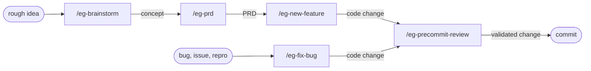

# Elephant/Goldfish for Claude Code

A reusable workflow for software work with Claude Code, built around the elephant/goldfish pattern from [Daniel Rensin's article](https://drensin.medium.com/elephants-goldfish-and-the-new-golden-age-of-software-engineering-c33641a48874).

---

## Quick start

**In your target repo, open a Claude Code session and paste this message:**

> Fetch the elephant-goldfish bootstrap procedure with
> `gh api repos/vshvedov/elephant-goldfish/contents/BOOTSTRAP.md -H 'Accept: application/vnd.github.raw'`,
> then follow the procedure to set up the elephant/goldfish workflow here.

That's the whole install. Claude reads `BOOTSTRAP.md`, inspects your stack, fetches the five command templates and the CLAUDE.md snippet the same way, customizes them for the detected language and conventions, writes them into `<target>/.claude/commands/`, and updates your `CLAUDE.md`. See [Bootstrap a new repo](#bootstrap-a-new-repo) below for the full procedure.

**Why `gh api` instead of `git clone`?** No working copy left lying around — just text streamed in, customized, and written into the target. Cleaner than clone for a one-shot setup, and works the same whether this repo is public or private.

---

## The pattern

### Elephant

Your working session: Claude Code with full context — this conversation, CLAUDE.md, the files Claude has read in the last few turns, the decisions you've already made together. The elephant carries the institutional memory.

### Goldfish

A fresh subagent spawned with no prior context. It receives only what you hand it: a problem statement, a design doc, or a diff. It has no idea what you've been thinking. That's the point.

### The asymmetry is the test

If a goldfish, given only the problem statement, lands somewhere different from where the elephant started, that disagreement is the cheapest signal you'll get that you were anchored. If a goldfish, given only the design doc, can't implement the same thing you intended, the doc is wrong — not the goldfish. **Design is the new code.** When AI generates more code than humans can review, the human-readable doc becomes the primary artifact, and a fresh reader who can act on it alone is the cheapest correctness check available.

---

## The pipeline

> `/eg-brainstorm` produces a **concept**. `/eg-prd` turns a concept into **requirements**. `/eg-new-feature` and `/eg-fix-bug` produce **code**. `/eg-precommit-review` produces **validated code**. Each upstream stage feeds the next.

You don't have to start at the top. Pick the stage that matches what you have:

| You have | Start with | The output |
|---|---|---|
| A half-formed thought, no direction yet | `/eg-brainstorm` | A concepts brief; pick a direction. |
| A direction but no requirements | `/eg-prd` | A PRD: scope, users, metrics, open questions. |
| A clear feature to build | `/eg-new-feature` | Implemented + reviewed code, ready to commit. |
| A bug or a `#<issue>` | `/eg-fix-bug` | A failing-test-driven fix, ready to commit. |
| A diff already in hand | `/eg-precommit-review` | A reviewer-cleared diff, ready to commit. |

### How each stage uses the pattern

**`/eg-brainstorm`** inverts the pattern. Instead of one goldfish stress-testing the elephant, multiple goldfish run in parallel — each with a different lens (technical, business, UX, contrarian, market research) — to generate divergent ideas the elephant synthesizes into a concepts brief. All clarifying questions go through `AskUserQuestion`.

**`/eg-prd`** uses two waves of goldfish. First, exploration goldfish ground the request in the existing codebase. Then, after structured gap-filling Q&A with the user, research goldfish run in parallel across distinct lenses (web search, optional Chrome MCP for logged-in sources like Reddit). The elephant synthesizes a PRD with explicit Open Questions for whatever the user deferred.

**`/eg-new-feature`** uses one goldfish to stress-test the design doc the elephant drafted. If the goldfish can't implement the same thing from the doc alone, the doc gets revised. Implementation only starts after the doc is "design ready." Then the same diff goes through `/eg-precommit-review`.

**`/eg-fix-bug`** uses one goldfish to diagnose the bug from only the symptom and repro. The elephant's hypothesis stays hidden until after the goldfish reports — convergence buys confidence; divergence is signal. The bug gets captured as a failing test before any fix is written.

**`/eg-precommit-review`** is itself a goldfish. It sees only the diff, not the conversation. Findings are triaged round by round, with a hard cap and an `AskUserQuestion` escalation if the loop doesn't converge.

---

## Commands

| Command | When to use |
|---|---|
| `/eg-brainstorm <rough idea>` | Early-stage concept design. Multiple goldfish in parallel. Web search optional. Output: concepts brief. |
| `/eg-prd <idea \| feature \| #issue>` | Turn a concept (or rough feature description) into a PRD. Codebase grounding, structured gap-filling, deep research. Output: PRD. |
| `/eg-fix-bug <description \| #issue \| URL>` | Bug fix flow. Problem doc → goldfish diagnosis → failing test → fix → review → test gate. |
| `/eg-new-feature <description \| #issue \| URL>` | Feature flow. Scope confirm → design doc → goldfish design check → implement → review → test gate. |
| `/eg-precommit-review` | Local independent-review loop on the pending diff. Lint + typecheck + tests as pre-flight, then a fresh subagent reviews the diff cold. |

Implementation commands (`/eg-fix-bug`, `/eg-new-feature`) stop short of committing. The user authorizes the commit explicitly when ready.

You give a one-liner; Claude writes the doc back at you. **You don't author docs by hand.** Most docs live in chat. They land on disk only when there's a future-you reason to keep them — a substantial feature, a new subsystem, a saved brainstorm brief, a PRD that will be revisited.

---

## Bootstrap a new repo

(See the [Quick start](#quick-start) at the top for the one-line invocation.)

After you give Claude the `gh api` instruction, Claude will:

1. Read [BOOTSTRAP.md](BOOTSTRAP.md) for the procedure.
2. Inspect the target repo's stack — `package.json`, `Gemfile`, `pubspec.yaml`, `pyproject.toml`, `mise.toml`, `.tool-versions`, CI config, etc.
3. Read the target's `CLAUDE.md` if it exists; otherwise propose creating one.
4. Customize the five generic templates in [commands/](commands/) for the detected stack: pre-flight commands, test tier picks, browser-validation path, stack-specific "Hunt for" items in the reviewer prompt, and the PRD save location for `/eg-prd`.
5. Drop the tailored files into `<target>/.claude/commands/`.
6. Inject the "Working with Claude Code" section ([claude-md-snippet.md](claude-md-snippet.md)) into the target's `CLAUDE.md`.
7. Print a summary and stop short of committing.

The customized commands keep the same shape (problem doc, goldfish, failing test, review, gate) but speak the target's language: `mise exec ... rails test` for Rails, `flutter test` for Flutter, `npm test && npm run test:e2e` for Node, and so on.

---

## Project-specific commands

Some projects need a stack-specific verb the generic commands don't cover — for example, a creative-coding project that ships modular plugins might want `/eg-new-plugin` with a recipe covering the manifest, DSP, registration steps, and a hardware-style verification pass. A SaaS with a heavy schema layer might want `/eg-new-migration` with a backfill rubric.

Pattern:

1. Copy `commands/eg-new-feature.md` from your target as the starting shape.
2. Tailor: replace the design rubric with the project-specific recipe (the architectural invariants, the canonical "how to add one of these" steps from your CLAUDE.md, the verification path).
3. Add a `Routing` note at the top of `/eg-new-feature.md` so users and Claude know when to switch.

Use the `eg-` prefix for any project-specific command — keeps the namespace consistent so the elephant/goldfish set is grep-able and won't collide with generic verbs like `/prd` or `/research`.

The command stays in `<target>/.claude/commands/` only — it's project-specific, doesn't belong in this template repo.

---

## Why a separate repo

So the templates evolve in one place. When you tighten `/eg-precommit-review`'s reviewer prompt because the goldfish kept missing a class of bug, you do it here once, and re-bootstrap the projects that pull from this. Projects can pin to a specific commit if they want a frozen version.

---

## License

MIT. Use it, fork it, send PRs.
